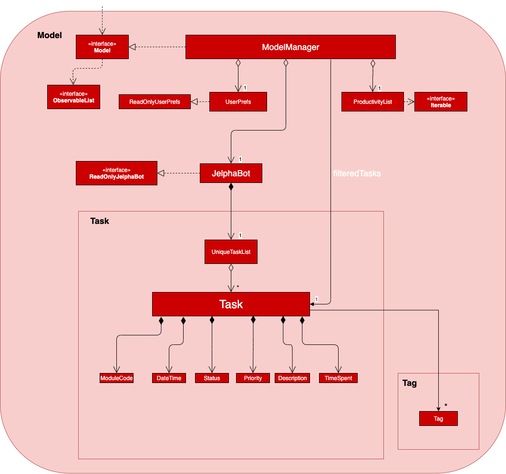

= JelphaBot - Developer Guide
:site-section: DeveloperGuide
:toc:
:toc-title:
:toc-placement: preamble
:toclevels: 4
:sectnums:
:imagesDir: images
:stylesDir: stylesheets
:xrefstyle: full
ifdef::env-github[]
:tip-caption: :bulb:
:note-caption: :information_source:
:important-caption: :heavy_exclamation_mark:
endif::[]
:repoURL: https://github.com/AY1920S2-CS2103T-F09-2/main

By: `Team 2103T-F09-02`      Since: `Jan 2020`      Licence: `MIT`

== Preface
=== Introduction

JelphaBot is *a desktop app for managing tasks* for NUS students. JelphaBot is designed to allow these students
to manage tasks conveniently and aids students by *allowing important tasks to be easily recognised*.

Users enter commands in JelphaBot through a *Command Line Interface* (CLI). However, a Graphical User Interface (GUI)
is still used for improved design and user experience.

JelphaBot is based on the AddressBook-Level3 (AB3) project created by SE-EDU initiative at https://se-education.org

=== Purpose of this Document
The following section describes the software architecture and design decisions behind the implementation of JelphaBot.
This guide is intended for developers who wish to maintain, modify or understand the software development behind our application.
The guide is divided into various sections. First, it explores the overarching architecture of the software before exploring each individual component,
as well as the individual implementations of each distinct feature.

The guide is designed to be read as-needed, new developers can choose to start from the overarching view before narrowing down to the specific implementation they require.

This Developer Guide consists of the following sections:

* <<Setting Up, Setting Up>> - Assists new developers in cloning and initializing a copy of JelphaBot.
* <<Design, Design>> - Provides an overview of the architecture design.
* <<Implementation, Implementation>> - Brief explanation of how features in JelphaBot were implemented on top of AB3,
and explains the design considerations of these implementations.
* <<Documentation, Documentation>> - A guide for generating and publishing documentation.
* <<Testing, Testing>> - A guide for developers to set up and run test code.
* <<Dev Ops, Dev Ops>> - A guide for developers to build, test and release JelphaBot.

=== Notation used in this Guide
.Common symbols used throughout this guide.
[width="70%",cols="^15%,85%"]
|===
a| `code` | A Java method or class
ifdef::env-github[]
| :bulb: | Tips and tricks that might be useful
| :information_source: | Additional information that is good to know
| :heavy_exclamation_mark: | Important pointers to take note
endif::[]
ifndef::env-github[]
a| [.java]#name# | Reference to the codebase (such as component, class and method names)
a| icon:lightbulb-o[role="icon-tip",size="2x"] | Tips and tricks that might be useful
a| icon:info-circle[role="icon-note",size="2x"] | Additional information that is good to know
a| icon:exclamation-circle[role="icon-important",size="2x"] | Important pointers to take note
endif::[]
|===

== Setting Up

Refer to the guide <<SettingUp#, here>>.

== Design

JelphaBot is a desktop app built in Java based on the AddressBook-Level3 project created by the SE-EDU initiative,
and inherits its architectural design. The software is split into various components, each with its own package.
Each component is in charge of a single aspect of the software.

[TIP]
The data in JelphaBot is stored as .json files in the `data` subdirectory.

//tag::designarchitecture[]
[[Design-Architecture]]
=== Architecture
The *_Architecture Diagram_* given below explains the high-level design of the App.

.Architecture Diagram
image::ArchitectureDiagram2.png[]
//end::designarchitecture[]

The *_Architecture Diagram_* given above explains the high-level design of the App. Given below is a quick overview of each component.

[TIP]
The `.drawio` files used to create diagrams in this document can be found in the link:{repoURL}/tree/master/docs/diagrams/[diagrams] folder.
To update a diagram, import the `.drawio` file to the https://draw.io[webapp].

Given below is a quick overview of each component.

`Main` has two classes called link:{repoURL}/blob/master/src/main/java/seedu/jelphabot/Main.java[`Main`] and link:{repoURL}/blob/master//src/main/java/seedu/jelphabot/MainApp.java[`MainApp`]. It is responsible for,

* At app launch: Initializes the components in the correct sequence, and connects them up with each other.
* At shut down: Shuts down the components and invokes cleanup method where necessary.

<<Design-Commons,*`Commons`*>> represents a collection of classes used by multiple other components.
The following class plays an important role at the architecture level:

* `LogsCenter` : Used by many classes to write log messages to the App's log file.

The rest of the App consists of four components.

* <<Design-Ui,*`UI`*>>: The UI of the App.
* <<Design-Logic,*`Logic`*>>: The command executor.
* <<Design-Model,*`Model`*>>: Holds the data of the App in-memory.
* <<Design-Storage,*`Storage`*>>: Reads data from, and writes data to, the hard disk.

Each of the four components

* Defines its _API_ in an `interface` with the same name as the Component.
* Exposes its functionality using a `{Component Name}Manager` class.

For example, the `Logic` component (see the class diagram given below) defines it's API in the `Logic.java` interface and exposes its functionality using the `LogicManager.java` class.

.Class Diagram of the Logic Component
image::LogicClassDiagram.png[][width="750"]

[discrete]
==== How the architecture components interact with each other

The _Sequence Diagram_ below shows how the components interact with each other for the scenario where the user issues the command `delete 1`.

.Component interactions for `delete 1` command
image::interaction.png[]

The sections below give more details of each component.

[[Design-Ui]]
=== UI component
The Ui Component handles interactions between the user and the application.
This includes input fields where commands are entered as well as translations of data in the Model Component to a visual representation in the interface.

.Class Diagram of the UI Component
image::UiClassDiagram.png[][width="750"]

*API* : link:{repoURL}/blob/master/src/main/java/seedu/jelphabot/ui/Ui.java[`Ui.java`]

The UI consists of a `MainWindow` that is made up of parts e.g.`CommandBox`, `CalendarDayCard`, `ResultDisplay`, `TaskListPanel`, `StatusBarFooter` etc.
All these, including the `MainWindow`, inherit from the abstract `UiPart` class.

The `UI` component uses JavaFx UI framework. The layout of these UI parts are defined in matching `.fxml` files that are in the `src/main/resources/view` folder. For example, the layout of the link:{repoURL}/blob/master/src/main/java/seedu/jelphabot/ui/MainWindow.java[`MainWindow`] is specified in link:{repoURL}/blob/master/src/main/resources/view/MainWindow.fxml[`MainWindow.fxml`]

The `UI` component,

* Executes user commands using the `Logic` component.
* Listens for changes to `Model` data so that the UI can be updated with the modified data.

[[Design-Logic]]
=== Logic component
The Logic component handles the business logic after a command is executed.

[[fig-LogicClassDiagram]]
.Structure of the Logic Component
image::LogicClassDiagram.png[][width="750"]

*API* :
link:{repoURL}/blob/master/src/main/java/seedu/jelphabot/logic/Logic.java[`Logic.java`]

.  `Logic` uses the `JelphaBotParser` class to parse the user command.
.  This results in a `Command` object which is executed by the `LogicManager`.
.  The command execution can affect the `Model` (e.g. adding a task).
.  The result of the command execution is encapsulated as a `CommandResult` object which is passed back to the `Ui`.
.  In addition, the `CommandResult` object can also instruct the `Ui` to perform certain actions, such as displaying help to the user.

Given below is the Sequence Diagram for interactions within the `Logic` component for the `execute("delete 1")` API call.

.Interactions Inside the Logic Component for the `delete 1` Command
image::DeleteSequenceDiagram.png[]

[[Design-Model]]
=== Model component
The Model component provides an internal data representation of all tasks stored in JelphaBot, as well as methods to modify that data.

.Structure of the Model Component
[width="750"]

*API* : link:{repoURL}/blob/master/src/main/java/seedu/jelphabot/model/Model.java[`Model.java`]

The `Model`,

* stores a `UserPref` object that represents the user's preferences.
* stores JelphaBot data.
* exposes an unmodifiable `ObservableList<Task>` that can be 'observed' e.g. the UI can be bound to this list so that the UI automatically updates when the data in the list change.
* does not depend on any of the other three components.

//[NOTE]
//As a more OOP model, we can store a `Tag` list in `JelphaBot`, which `Task` can reference. This would allow `JelphaBot` to only require one `Tag` object per unique `Tag`, instead of each `Task` needing their own `Tag` object. An example of how such a model may look like is given below. +
// +
//image:BetterModelClassDiagram.png[]

[[Design-Storage]]
=== Storage component
The Storage component manages storing and retrieving of data onto local files in .json format.

.Structure of the Storage Component
image::Storage.png[][width="750"]

*API* : link:{repoURL}/blob/master/src/main/java/seedu/jelphabot/storage/Storage.java[`Storage.java`]

The `Storage` component,

* can save `UserPref` objects in json format and read it back.
* can save JelphaBot data in json format and read it back.

[[Design-Commons]]
=== Common classes

Classes used by multiple components are in the `seedu.JelphaBot.commons` package.
This includes classes which implement utility functions which can be used by all other components.

== Implementation

This section describes some noteworthy details on how certain features are implemented.

=== Tab System
Users may find it complicated to handle the many features that JelphaBot offers. They might also be overwhelmed if all the information of their tasks were to be displayed together in one screen.

As such, we have decided to implement a tab system for JelphaBot to organise the available commands into their respective features. JelphaBot provides 5 different tabs for the users,
each displaying a different set of panels that are relevant to the feature.

* *Summary Tab* - <
> of the day's tasks in the task list.
* *Task List Tab* - <<Task Grouping feature in Task List tab (Yao Jie), view all tasks>> in the task list.
* *Calendar Tab* - <<Calendar feature (Amanda), visualisation>> of tasks in a specific day or month.
* *Productivity Tab* - <<Productivity feature (Jel), overarching view>> of overall productivity such as task completion rate.
* *Reminder Tab* - <<Reminder feature (Dian Hao), list>> of upcoming reminders.

To use the different features, we have also implemented commands for users to switch between the 5 tabs.

[[ChangeTab]]
// tag::changetab[]
==== Implementation

[[ChangingTabs]]
===== Switching between Tabs in Main Window

The tabs of the application are defined using a `SwitchTab` enum and the current tab of the application is stored as a private attribute `mode` in `LogicManager`.
Users can switch between tabs in JelphaBot using the lower case names of each tab as commands (e.g. `calendar`). +
When the tab of the application is changed, we need to update the:

* `MainWindow` component so that the `SwitchTab` attribute in `MainWindow` reflects the new current tab, since this is used to check if a command can be executed,
* `UI` component so that the panels display the information that is relevant to the tab.

IMPORTANT: `task list` is not a valid command to switch to the Task List tab.
Use `list` instead.
Similarly, `:l` is the corresponding shortcut.

For all these commands, updates are done by updating the `SwitchTab` attribute added in the `CommandResult` object.

As an example, the figure below shows the sequence diagram of when a user executes the `:s` or `summary` command.

[[Summary-SwitchTab-Sequence-Diagram]]
.Sequence diagram of execution of the `summary` command
image::SummarySwitchTabSequenceDiagram.png[]

Upon execution of the `:s` command, `SummaryCommand#generateCommandResult()` will generate a `CommandResult` whose `SwitchTab` attribute is set to `SUMMARY` and return it to the `LogicManager`.
Now, the updates can be done for the respective components:

* `UI` component: `MainWindow` calls `MainWindow#executeCommand()`, to retrieve the tab to be changed to and updates the current tab stored in its `SwitchTab` attribute by calling `CommandResult#isShowXXX()` where `XXX` is the tab to switch to.
The display panel is updated by calling `MainWindow#handleXXX` where `XXX` is the tab to switch to.
// end::changetab[]

// tag::summary[]
=== Summary feature (Eden)

JelphaBot has a Summary feature which provides an overview of the tasks due within the day as well as all tasks that have been complete within the day.

This feature comes in the form of a summary panel, which comprises of two sections for the tasks due within the day and the tasks completed within the day respectively.

For each task shown only details such as the Module Code and the Description are shown.

Once the user marks a task due within the day as complete, it will automatically appear under the tasks completed within the day.

[NOTE]
If the user marks a task as completed, and immediately deletes the task from the task list, it will not appear in the summary screen.

==== Implementation

The implementation of this panel is facilitated by the `summary` package.

Upon creation, the `Summary` object obtains the main task list from `Model`.
The task list is then filtered with the help of `TaskDueWithinDayAndIncompletePredicate` and `TaskCompletedWithinDayPredicate` to obtain two lists with the desired tasks.

These lists are stored as fields in the `Summary` class and are used to display the relevant information in the summary panel.

The following class diagram shows the structure of the classes in the `summary` package, in relation with their `Ui` counterparts.

[[SummaryPanelClassDiagram]]
.Class diagram of structure and relations of `Summary`, `SummaryPanel` and their components.
image::SummaryPanelClassDiagram.png[]

To view the respective tasks, the user enters the `summary` command. Upon entry of the `summary` command, a `SummaryCommand` object will be created and `SummaryCommand#execute()`
will be called.

The following sequence diagram details the execution when `SummaryCommand#execute()` is called.

.Sequence diagram of the creation of the `Summary` object when `SummaryCommand#execute()` is executed.
image::SummaryCommandSequenceDiagram.png[]

==== Design considerations

===== Aspect 1: The summary panel depends on the creation of new `Summary` objects to be updated

* *Current solution*: Each time `DoneCommand` is executed, a new Summary object is to be created, and along with it the task lists
contained inside the `Summary` object is updated and displayed on the summary panel as an updated list.
** Pros: Easy to implement. Scalable when there are more things are to be displayed on the summary panel.
** Cons: Consecutive `done` commands are expensive, as the lists in the `Summary` object are reinitialised upon every `done` command.

* *Alternative 1*: Have a single `Summary` object with underlying task list listeners to update the relevant task lists
** Pros: Only one `Summary` object will have to be created for the duration the application is open. The task lists in the `Summary` object
do not have to be reinitialised upon every `done` command.
** Cons: May not be scalable if there are many things to be added to the summary panel in the future, as this will require more listeners,
and the presence of many listeners may affect the performance of the application.

* *Reason for chosen implementation:*
The current implementation is more straightforward and simpler to implement, as the `SummaryList` and `SummaryPanel` which are used to display the contents of the summary
panel simply need to extract and display the contents of the `Summary` object that was given, instead of requiring underlying listeners to keep track of whatever is happening within
the application.

===== Aspect 2: Summary panel aesthetic improvements

* *Current solution*: The Welcome header, tasks due today and tasks completed subsections have the same font and styling. The distinction between them
is by the bigger font for the Welcome header, and the space separation between the subsections. This is done by having each section in their own separate `Vbox`.
Everything shown on the panel is shown as plain text, with no additional styling.
** Pros: This gives the summary panel a minimal look that is simple and easy to look at, while still providing the user with the relevant information that is needed.
** Cons: Due to the implementation of the subsections as separate boxes of equal sizes that are scaled to fit the panel, there is a lot of unused space in between each subsection, if there
are not enough tasks to fill in the space. This can be seen as a waste of space.
* *Alternative 1*: Add font styling and section highlighting to different sections of the summary panel
** Pros: Makes the summary panel more visually appealing, and makes each subsection more distinct from each other.
** Cons: Does not solve the problem of unused space when there are not enough tasks to fill the space in each subsection.

* *Reason for chosen implementation:*
The current implementation is easier to implement and keeps the summary panel simple and easy to look at as it avoids the cluttering of the summary panel with too many different design elements.
This makes it very user-friendly, and it also easily scalable in the future as each section is already partitioned accordingly, so future changes to the summary panel simply have to change the elements
within each section.

// end::summary[]

// tag::taskgroups[]
=== Task Grouping feature in Task List tab (Yao Jie)
==== Implementation

The task category mechanism is facilitated by the `ViewTaskList` interface, which serves as a wrapper for any list of tasks. +
The ViewTaskList interface supports methods that facilitate getting and iterating through the tasks contained within the list.
This is to accommodate a common access for Tasks in `GroupedTaskList`, which contains multiple sub-lists. +
The diagram below describes the class structure.

.Class Diagram for Task List classes
image::TaskListClassDiagram.png[]

Grouping tasks into sub-lists is done through the `GroupedTaskList` class. +
Each `GroupedTaskList` is a container for `ObservableList<Task>` objects, each containing a unique filter over the full task list.

Each `GroupedTaskList` implements the following operations on top of those in `ViewTaskList`:

* A enum class which describes the valid `Category` groupings, and the corresponding methods of getting these groupings from a `String`. +
* An `ObservableList` of `SubgroupTaskList` that represents the sub-groupings of each corresponding `Category`.
* A public method for instantiating a `GroupedTaskList` called `getGroupedList` with the return from `getFilteredTaskList()` as argument.
* An iterator method which iterates through a list of `SubgroupTaskList`.

Users can modify the `GroupTaskList` being displayed in the main panel by executing a `ListCommand`.
The operation for retrieving the corresponding `GroupedTaskLists` are exposed in the `Model` interface as `Model#getGroupedTaskList(Category category)`. +
Currently, the supported groupings for JelphaBot are group by date (`GroupedTaskList.Category.DATE` and `GroupedByDateTaskList`) and group by module (`GroupedTaskList.Category.MODULE` and `GroupedByModuleTaskList`).

The following diagram shows the sequence flow of a `ListCommand` which modifies the currently shown Task List:

[[activity-swapping-groupedtasklist]]
.Activity Diagram showing the tab switch for ListCommand
image::ListCommandActivityDiagram.png[]

Given below is an example usage scenario and how the task category mechanism behaves at each step.

*Step 1.* The user launches the application for the first time.
The `MainWindow` will be initialized with `GroupedTaskListPanel` as a container for GroupedTaskList model objects.
The panel is populated with sublists defined in `GroupedByDateTaskList`.

*Step 2.* The user executes `list model` to switch to category tasks by module code instead. `GroupedTaskListPanel` is repopulated with sublists defined in `GroupedByModuleTaskList`.

[NOTE]
If the user tries to switch to a `Cateory` which is already set, the command does not reinitialize the `GroupedTaskList` to prevent redundant filtering operations.

As `GroupedTaskList` has more than one underlying `ObservableList<Task>`, tasks cannot be retrieved the usual way.
Thus, the `get()` function defined in the `ViewTaskList` interface must be implemented and used instead. +
The following diagram shows the process of retrieving a `Task` from `ViewTaskList` when it is an instance of `GroupedTaskList`:

[[sequence-viewtasklist-get]]
.Sequence Diagram for `ViewTaskList.get()`
image::ViewTaskListGetSequenceDiagram.png[]

As the index passed as an argument to `lastShownList.get()` is a cumulative index, the implementation of `get()` in `ViewTaskList` has to iterate through each `SubgroupTaskList` stored within.

Tasks are organized via a two-dimensional list.
In this case, a `Task` is rendered into a `TaskCard`, and `TaskCard` elements are rendered within `SubGroupTaskListCell` elements which are listed in `SubgroupTaskListPanel`.
A populated `SubgroupTaskListPanel` element is rendered as a `GroupedTaskListCell` which is listed in the top-level `GroupedTaskListCell`. +
`SubgroupTaskListCell` and `GroupedTaskListCell` implement the `ListViewCell<T>` interface of the `ListView<T>` class provided by JavaFX.

.Class Diagram for UI classes displaying `GroupedTaskList`
image::TaskListPanelClassDiagram.png[]

The detailed interactions are described in the diagram shown above.
As can be seen, the distribution of `ListViewCell` elements follows the way tasks are distributed within the model classes.
Each `SubgroupTaskListPanel` is displaying a singular `SubgroupTaskList`, which firther contains a list of `Task` entities.

The indexes displayed in each `TaskCard` is dynamically computed from a `NumberBinding` which computes the index of that element in the list.
The `NumberBinding` observes the place of the task within the current `SubgroupTaskList` as well as the number of elements in the preceeding sublists.
The sum of both numbers gives the index for the current element, which is set using `setId()`. `TaskCard` elements are updated with `populateTaskElements()`.

Each `TaskCard` will also have a different visual presentation depending on the value of the `Priority` of the task.
The method which adjusts the visual presentation of a `Task` is `applyPriorityMarkdown()`.

The following images show how `Task` entities of different priorities are displayed: +

.Markdown for Tasks of different priority. (Top to bottom: Normal, High, Low.)
image::PriorityMarkupForTaskCards.png[]

==== Design Considerations

===== Aspect 1: `ListCommand` swaps to a different `ViewTaskList`

Refer to <<activity-swapping-groupedtasklist>> for the diagram describing this process.

* *Current solution*: Initializes each grouped list as each `ListCommand` is called and stores the latest list as `Model.lastShownList`.
** Pros: Easy to implement.
Scalable when more groupings are added.
** Cons: Consecutive `ListCommand` operations which swap between different categories are expensive as the list is reinitalized each time.
** Cons: It is hard to keep track of the exact type of list in `lastShownList`, which may lead to unexpected behavior.
* **Alternative 1:** Keep instances of all `GroupedTaskList` objects and update them as underlying Task List changes.
** Pros: Consecutive `ListCommand` executions are less expensive.
** Cons: All other commands that update the underlying list now have additional checks as each grouped list is updated.

*Reason for chosen implementation:* +
The current solution was chosen in order to accomodate more `Category` implementations in the future.
With only two classes inheriting `GroupedTaskList`, it is entirely feasible to implement both.
However, since only one `GroupedTaskList` will be used at any time, and to take account possible performance savings, only one `GroupedTaskList` implementation will exist at any one time.

===== Aspect 2: `get()` Task from `ViewTaskList` and iterate between Tasks.

Refer to <<sequence-viewtasklist-get>> for the diagram describing this process.

* *Current solution*: Implement `get()` and `Iterator<Task>` in `ViewTaskList`.
** Pros: Easy to implement.
Scalable when more groupings are added.
** Cons: Consecutive `ListCommand` operations are expensive as the list is reinitalized each time.
** Cons: It is hard to keep track of the exact type of list in `lastShownList`, which may lead to unexpected behavior.
*** As a workaround, only operations defined in the `ViewTaskList` interface should be used.
* **Alternative 1:** Keep instances of all `GroupedTaskList` objects and update them as underlying Task List changes.
** Pros: Consecutive `ListCommand` executions are less expensive.
** Cons: All other commands that update the underlying `UniqueTaskList` will result in multiple update calls to `ViewTaskList`.

*Reason for chosen implementation:* +
The current solution was chosen with integration with other tabs in mind.
This implementation can easily be expanded to other tabs in a future version if other tabs also inherit from `ViewTaskList`.
This allows `add`, `edit`, `delete` and `done` commands to be executable from any tab, while still only requiring one `ViewTaskList` to be instantiated, which saves performance.

//===== Aspect 3: Hide empty Categories in `GroupByDateTaskList`
//
//* *Current Solution*: UI displays problems from a `FilteredList<SubgroupTaskList>` and use `filtered()` to hide empty categories without removing them.
//** Rationale: These categories are meant to be reused when applicable tasks are added back to the list.
//** Pros: The list categories do not have to be reinitalized as tasks are removed or added.
//** Cons: Additional load on the UI as the Filtering happens constantly.
//However, since there is a cap on five categories (so five `FilteredList` lists), it is unlikely to be significant.
//** Cons: Inconsistent with the way filtering is done in `GroupByModuleTaskList`, which reduces control abstraction in `GroupedTaskList`.
//* **Alternative 1:** Remove categories which are no longer used, and reinitialize them again when needed.
//** Pros: Consecutive changes to the underlying Task List are less expensive if less lists are currently active.
//** Pros: Enforce consistency with `GroupByModuleTaskList` which might allow some methods to be abstracted to parent class.
//** Cons: Empty `SubgroupTaskList` members have to be hidden manually which requires complex logic in `SubgroupTaskListPanel`.
//** Cons: Additional listeners have to be added (one for each category) to reinitialize empty categories.

===== Aspect 3: Remove empty Categories in `GroupByModuleTaskList`

* *Current Solution*: UI displays problems from a `FilteredList<SubgroupTaskList>` and uses a `ListChangeListener<Task>` to maintain a set of unique module codes when the underlying task list is changed.
The `ObservableSet<ModuleCode>` has a further `SetChangeListener<ModuleCode>` bound to it to remove categories that no longer contain any Tasks.
This second listener directly removes unused categories from `GroupedByModuleTaskList`.
** Pros: Consecutive changes to the underlying Task List are automatically reflected with a change in `SubgroupTaskList` categories.
** Pros: The delegation of responsibilities between each `Listener` allows Single Responsibility Principle to be maintained.
** Cons: Dependency between the two `Listener` classes has to be maintained.
* **Alternative 1:** Hide categories which are no longer used by adding a filter to the Task List returned.
** Pros: Easy to implement and understand.
** Cons: Not practical: as more Module Codes are added to the Task List, it might cause more and more hidden categories to be created which are expensive to filter through.
* **Alternative 2:** Abstract maintenance of the set of unique module codes to a `UniqueModuleCodeSet` class instanced in `UniqueTaskList`.
** Pros: Easy to understand.
Logic is further abstracted to a higher level and the new class is instanced together with the list that affects it.
** Pros: The returned `ObservableSet<ModuleCode>` from `UniqueModuleCodeSet` can be made unmodifiable which would prevent unauthorized changes to the `ObservableSet` from other classes.
** Cons: Implementation is challenging and prone to bugs, requiring significant testing.
Due to the time of writing this Developer guide, the release is nearing V1.4 and time is spent fixing bugs for release instead.
** This could be a proposed update in the future.

*Reason for chosen implementation:* +
The best solution would be to create a `UniqueModuleCodeSet` instanced in `UniqueTaskList`, which would have the best scalability and abstraction.
In addition, since such a set would be updated regularly, less mantainence is needed inside classes that require a list of unique `ModuleCode` entities.
However, due to time constraints, such an implementation was not chosen.
However, the current solution mimics the best solution as closely as possible by using `SetChangeListener` to update the `SubgroupTaskList` list.
This means that a returned `UnmodifiableObservableSet` from `UniqueModuleCodeSet` can be substituted easily whenever such a refactoring is done.
// end::taskgroups[]

// tag::calendar[]
=== Calendar feature (Amanda)

JelphaBot has a calendar feature which provides an overarching view of their schedules and to allow users to view their tasks due.

This feature offers two main functions:

** Displays an overview of tasks in calendar for a selected month and year
** Displays a list of tasks due for a specified date

====  Implementation

The implementation of the main calendar panel is facilitated by the `CalendarMainPanel` class, which serves as the main
container for this feature. This main container consists of a `SplitPane` comprising of a `CalendarPanel` on the right,
which displays the calendar view in a month, and a `CalendarTaskListPanel` on the left to display specific tasks.

The diagram below describes the class structure of the calendar class structure.

.Class Diagram for Calendar classes
image::CalendarUiClassDiagram.png[]

Upon initialisation of the `CalendarMainPanel`, the `CalendarPanel` would be set to display the current month and year calendar,
with the dates filled up by `CalendarDayCards` by CalendarPanel#fillGridPane() with a `CalendarDate` starting from the first day of the current month.
Today's date would also be highlighted, with `CalendarTaskListPanel` set to display the tasks due today by running
Logic#getFilteredCalendarTaskList() and then Logic#updateFilteredCalendarTaskList() with a predicate to filter by today's date.

The following diagram depicts how each individual day cell of the calendar will look like:

.Expected display of dates on calendar
image::CalendarDayCards.png[]

After every execution of command, MainWindow#updateTasksInCalendarDayCards() will be run such that any commands that updates
the JelphaBot task list (e.g `DoneCommand`, `DeleteCommand`, `EditCommand`) would be updated by the dot indicators in the calendar.

**Function 1: Displays an overview of tasks in calendar for a selected month and year**

There are 2 commands that users can issue to perform function 1:

1. `calendar today`: Displays calendar for the current month with today's date highlighted, and its corresponding tasks due listed. +
2. `calendar MONTHYEAR`: Displays calendar for the month and year specified, with the first day of the month highlighted,
and its corresponding tasks due listed (e.g. calendar Apr-2020). Refer <<Calendar-MonthYear-SequenceDiagram, here>>, for the diagram describing this process.

Upon execution of the `calendar MONTHYEAR` or the `calendar today` command, CalendarCommand#execute() will run `updateFilteredCalendarTaskList()` to
filter the task list to display the tasks on the `CalendarTaskListPanel` according to the first day of the `MONTHYEAR` or the tasks due `today` respectively.
The filtering of the tasks according to date is done using the `TaskDueWithinDayPredicate`. A distinct `CommandResult` would then be generated according to
the input command and is returned to the `LogicManager`. Finally, the  `CommandResult` is passed to the `MainWindow` in UI. Now, the updates can be done for the respective components:

UI Component: Using the CommandResult, MainWindow calls MainWindow#updateCalendarMainPanel(), which is then passed to call CalendarMainPanel#updateCalendarPanel().
For the `calendar MONTHYEAR` command, this updates the `CalendarPanel` display with the respective `MONTHYEAR` view, and highlights the first day of the month.
For the `calendar today` command, this updates the `CalendarPanel` display to the current month and year, with today's date highlighted.

The following example sequence diagram shows you how the `calendar MONTHYEAR` (e.g. `calendar Apr-2020`) command works.

[[Calendar-MonthYear-SequenceDiagram]]
.Sequence diagram after running `calendar Apr-2020`
image::CalendarViewSequenceDiagram.png[]

**Function 2: Display a list of tasks due for a selected date in the month**

In order to display the task list for specific input dates, the user enters the `calendar DATE` command +
(e.g. calendar Jan-1-2020).

NOTE: Only a date belonging in the current displayed month on the `CalendarPanel` would be highlighted after
processing the `calendar DATE` command. A date that falls in other month and years would just display its
corresponding tasks due on the `CalendarTaskListPanel`.

The implementation of the previous two calendar commands (`calendar DATE` and `calendar today`) are largely similar and run in the same process.
The only exception is regarding the `calendar DATE` command which fulfills **Function 2** listed above, where the `GridPane` in `CalendarPanel` is not
altered by running CalendarPanel#fillGridPane() unlike the other two commands fulfilling **Function 1**. Only `CalendarTaskListPanel` is updated.

The following diagram shows the sequence flow for variants of these three calendar commands which modifies the `CalendarMainPanel`:
[[Calendar-ActivityDiagram]]
.Activity Diagram showing the updating of `CalendarMainPanel`
image::CalendarCommandActivityDiagram.png[]

==== Design Considerations

===== Aspect 1: How the user can navigate between specific dates and change the calendar month view
* *Current Solution:* Use the same `calendar` command word for both viewing tasks in specific dates, and changing the calendar view.
The next input following the command word (`DATE`, `MONTHYEAR`, `today`) is then parsed separately to give different command results.
** Pros: Easier and more understandable for user interactions.
** Pros: More open and accessible to future implementations regarding the calendar feature.
** Cons: Implementation in the `CalendarCommand` class might seem a bit bulky.
* **Alternative 1:** Use completely separate commands for viewing tasks in specific dates and changing the calendar view.
** Pros: Less chance of a parse exception, with more precise error messages when invalid command formats are input by the user.
** Cons: Certain areas of the code might be repetitive.
** Cons: Less intuitive for users to use.

*Reason for chosen implementation:* +
The current solution is more user-friendly as it reduces the number of varying commands that users have to remember in order to
access the respective information. Additionally, upcoming changes and future implementations can be easily integrated into the
existing code base as well.

===== Aspect 2: Method of storing `ObservableList<Task>` of tasks for each day card (Implementation of the Dot Indicator)
* *Current Solution:* Each `CalendarDayCard` stores a filtered list of tasks due on its specific date.
This is done by obtaining all the tasks in the task list from Logic#getFilteredTaskList() and applying a filter function
with the `TaskDueWithinDayPredicate`, specifically with the date of the day card. The list of tasks stored for each day card
in the calendar panel would be re-filtered after the execution of each command.
** Pros: Do not have to manually update the tasks stored in each `CalendarDayCard` (e.g add and remove manually in the separately stored copy)
** Cons: Completely reliant on the main task list, possible errors might be carried over.
* **Alternative 1:** Use a static HashMap of Dates as keys and a list of tasks due in that date as values.
** Pros: Retrieving the tasks in a specific date and storing in the day card is fast - can be done in O(1) time.
** Cons: Implementation would be much more complex.
** Cons: Updating of this HashMap of the tasks as the main task list is being edited constantly can be very tedious.

*Reason for chosen implementation:* +
The current solution is easier to implement since we are filtering the tasks we want to see directly from the main task list.
This reduces the amount of methods to implement over various class and components as constant updates of the tasks
in each day card of the calendar is done. The ease of implementation is crucial given the tight deadlines we have to meet for the project.
// end::calendar[]

// tag::productivityImplementation[]
=== Productivity feature (Jel)
JelphaBot has a productivity panel of this feature which provides an overarching view of user's overall productivity.

The view of this panel is facilitated by the productivity package that extracts the relevant data and displays them in as cohesive view.
The productivity package supports the creation of `TimeSpentToday`, `RunningTimers` and `TasksCompleted` instances.
Each of these classes iterate through the tasks contained within the task list. +
Below is a class diagram of the related productivity classes:

.Class diagram showing the structure and relations of `Productivity`, `ProductivityPanel` and their components.
image::ProductivityClassDiagram.png[]

This feature offers two main functions and one panel for visualisation:

** Start timer for a task.
** Stop running timer for a task.
** Productivity panel under Productivity tab.

====  Implementation

Text rendered onto the productivity panel is gotten from the `Productivity` class. +
A `Productivity` object is a container for the objects responsible for the sub-parts of the panel, namely `TimeSpentToday`, `RunningTimers` and `TasksCompleted`.
Each of these have their respective String representations which will be used in rendering the panel.

`TimeSpentToday` implements the following operations:

* An iterator method `getTimeSpent()` which iterates through a list of `ObservableList<Task>`.
** This iterator will extract the duration field of each task.
* A `toString()` method which returns the sum of duration (i.e. time spent) of tasks under 3 different categories: "due today", "due in next 6 days" and "due after 6 days".
[NOTE]
Each time `TimeSpentToday` is instantiated, `getTimeSpent()` is called thrice; once each for the 3 categories.

`RunningTimers` implements the following operations:

* An iterator method `getTasksWithTimers()` which iterates through a list of `ObservableList<Task>`.
** This iterator will extract the description and deadline of tasks with timers that have been started.
* A `toString()` method which returns the tasks with running timers.

`TasksCompleted` implements the following operations:

* An iterator method `getCompletionStatus()` which iterates through a list of `ObservableList<Task>`.
** This iterator will extract the number of tasks completed under the "due today" category.
* An iterator method `getOverdueStatus()` which iterates through a list of `ObservableList<Task>`.
** This iterator will extract the number of tasks that are incomplete and past their due date.
* A getter method which returns the percentage of tasks completed that are under the "due today" category.
* A `toStringArray()` method which returns the task completion status, JelphaBot's response to the user's productivity, as well as number of overdue tasks.

Information from all three objects are subsequently rendered onto the panel through `ProductivityCard` and `ProductivityPanel`.
// end::productivityImplementation[]

// tag::productivityFunctions[]
Assuming that the task list is not empty, the following describe the flow of `start 1` and `stop 1` which modify the currently shown productivity panel:

**Function 1: Starts timer for a specified task** +
In order to start timing a task, the user enters `start INDEX` command (e.g. `start 1`).

Upon successful execution of the command, the productivity tab displays the task being timed under the Running Timer(s) header.
The following diagram shows the flow of `start 1` which modifies the current view of the productivity panel:

[[activity-settingProductivitylist]]
.Activity Diagram showing the setting of `Productivity` in the `ProductivityList`
image::StartActivityDiagram.png[]

To update the productivity panel to reflect the changes, a new `Productivity` object will first be created, replacing the existing `Productivity` object in the `ProductivityList`.
Each time a new `Productivity` object is created, its corresponding booleans will dictate whether the sub-parts (i.e. `TimeSpentToday`, `RunningTimers` and `TasksCompleted`) are to be replaced with new objects.
As the command executed is `start`, a new `RunningTimers` object is created. As detailed above, the iterator method in `RunningTimers` will be called and a new String representation to be displayed onto the productivity panel will be created.
This String is subsequently rendered onto the panel under the Running Timer(s) header.

The following diagram shows the flow which updates the Running Timer(s) section in the productivity panel:

[[activity-updatingProductivityPanel]]
.Activity Diagram showing the updating of Running Timer(s) in the productivity panel
image::TimerPanelActivityDiagram.png[]

**Function 2: Stops timer for a specified task** +
In order to stop timing a task, the user enters `stop INDEX` command
(e.g. `stop 1`)

Upon successful execution of the command, the productivity tab removes the task being timed under the Running Timer(s) header.
Removing a task from the Running Timer(s) header is similar to adding it, as illustrated by the Activity Diagram <<activity-updatingProductivityPanel, above>>.
Under the Time Spent header, the total time spent will be increased depending on the date that the task is due.

[IMPORTANT]
Attempting to start timer for a task marked as completed or `stop` a task that does not have a running timer,
the command fails its execution so that it does not execute that `start` or `stop` operation to `start` or `stop` the timer for that task.

.Sequence Diagram after running `stop 1`
image::StopSequenceDiagram.png[]
// end::productivityFunctions[]

// tag::productivityDesign[]
==== Design Considerations

===== Aspect 1: Rendering sub-parts of productivity panel
* *Current solution*: Render each sub-part (i.e. task completion rate, time spent and running timers) only when that part needs to
be updated. All 3 parts are rendered on to the same card.
** Pros: Easy to implement and reduces waste of computational power.
** Cons: As all parts are displayed on the same card, if there happens to be problem in other parts of the card, all parts will be affected.
* *Alternative 1*: Abstract each part to a separate card and render all cards onto the same panel.
** Pros: Allows other parts to be rendered even when there is error on one part. Additionally, it is easier to identify bugs when there is
an error in displaying.
** Cons: Difficult to implement as current view is generated from a ListView but with a single card. Thus, abstracting and refactoring will be costly and hard to debug.
* *Alternative 2*: Employ multi-threading for rendering each sub-part.
** Pros: No need to use 3 different booleans when updating view. Code base will be cleaner and more readable.
** Cons: Unsure if cost of multi-threading less then of constructing 3 instances for rendering the productivity panel view.

*Reason for chosen implementation:* +
Minimal computational power is wasted as only the parts that requires re-rendering are recomputed. Moreover, it is easy to implement and easily extendable to display

===== Aspect 2: Restriction of functionality while timer is running
* *Current solution*: Tasks with running timers cannot be edited or marked as done.
** Pros: Other functionality are still available for use. Thus, overall user experience is not affected.
** Cons: User is unable to make changes to the task being timed nor mark it as complete.
* *Alternative 1*: Allow users to edit task while timer is running.
** Pros: User is able to use all features without restriction.
** Cons: Difficult to implement as the Task model requires a new Task to replace the old Task when edit command is executed. More storage space is also needed to store the additional start time field for each task.
* *Alternative 2*: Allow users to mark tasks as done while timer is running.
** Pros: Similar to the above, user is able to use all features without restriction.
** Cons: User may have forgotten about running timer and wish to collect such information. However, there is currently no function that supports undoing commands or unmarking a completed task.

*Reason for chosen implementation:* +
Editing and marking a task require the creation of a new task which overwrites the existing task. Use of space is also minimised and less computational power is used as no new Task objects have to be created.

===== Aspect 3: Productivity panel visualisation
* *Current solution*: Separating sub-parts by paragraphs and including progress bar for tasks completed.
** Pros: Easy to see at a glance which parts are which.
** Cons: Text under Running Timer(s) can appear wordy. As number of running timers increase, more text is added under Running Timer(s).
* *Alternative 1*: Highlight displayed module code and deadline in alternating colours
** Pros: Visually more appealing and looks less like a long list is tasks thus motivating the user to complete his/her tasks.
** Cons: Does not resolve the issue of having too many words under the sections.
* *Alternative 2*: Only show 3 tasks whose timers were started in order of priority and time when timers were started.
** Pros: Allows user to focus on tasks at hand.
** Cons: User might forget about other tasks whose timers were started and not complete them on time.

*Reason for chosen implementation:* +
We feel that paragraphing increases readability and the progress bar provides visual aid. Addtionally, including more images or pie charts may confuse or distract users from their tasks which defeats the purpose of JelphaBot.
// end::productivityDesign[]

// tag::reminder[]
=== Reminder feature (Dian Hao)
JelphaBot has a reminder feature that reminds users whenever they have tasks that are about to overdue.
This feature offers two main functions:

** Adds a reminder to a task.
** Delete a reminder that is associated to a task.

==== Classes for Reminder feature in Model
The `Reminder` feature was implemented by a new set of classes to `Model`. A new `Reminder` class is stored in
Jelphabot's `UniqueReminderList`, which consists of a list of `Reminder` s. Each `Reminder` consists of 3 objects: +
** `Index`**: the `Task` 's index of which the user wants to be reminded for. +
** `ReminderDay`**: the number of days before the `Task` 's deadline that the user wants to be reminded for. +
** `ReminderHour`**: the number of hours before the `Tasks` 's deadline that the user wants to be reminded for. +

The following class diagram summarizes shows the relationship between the classes.

.Reminder Class Diagram in the Model component
image::Reminderclass.png[]

==== Implementation
**Function 1: Creates a reminder for a specified task** +
To add a reminder to a certain task, the user enters the `reminder INDEX days/DAYS hours/HOURS` command.
(e.g, reminder 2 days/2 hours/1) +

The `Logic` `execute()` method creates a `ReminderCommand` from the input string by parsing the input according
to the command word and several other attributes. Next, the input string is converted into `Index`,
`ReminderDay`, `ReminderHour`, and a `Reminder` object with these properties are forwarded to `Model`. +

The `Model` first check the validity of the attributes respectively. The valid `Reminder` is then added to
the `UniqueReminderList` after checking that there are no other `Reminder` with the same `Index`. +

After the above actions are correctly performed, the `Logic` fires the `Storage` to save the `Reminder`.

Upon successful execution of the command, the user adds a reminder associated to the task at `INDEX`. Upon exiting JelphaBot,
the reminder will be saved. By the next time the users starts JelphaBot, it will remind the user should the task's due date fall
within the period set by the user from the current date. +

The sequence diagram for interactions between the `Logic`, `Model`, and `Storage` is shown below.

.Sequence Diagram after running `reminder 2 days/2 hours/1`
image::AddReminderSequenceDiagram.png[]

.The reference frame of getting the `CommandResult` in the `Logic` component.
image::getCommandResultReferenceDiagram.png[]

.The reference frame of adding the `Reminder` in the `Model` component.
image::addReminderReferenceDiagram.png[]

.The reference frame of saving a `Reminder` by the `Storage` component.
image::saveJelphaBot.png[]

[NOTE]
If the user attempts to add a reminder to tasks that have reminders, the command will fail to execute. The user also need not
to set reminders to tasks that are complete. However, if tasks that has reminders are not completed, JelphaBot will
still warn the user.

**Function 2: Deletes a reminder for a specified task** +
To delete a reminder associated to a certain task, the user enters the `delrem INDEX` command.
(e.g. delrem 2)

The interaction between components is similar to adding a `Reminder`. A key difference that this command
removes the `Reminder` that reminds the `Task` at `INDEX` from the `UniqueReminderList`. Moreover, `delrem` command
requires that the `Reminder` with `INDEX` is in the list.

Upon successful execution of the command, the reminder of the task at `INDEX` is removed.

==== Design Considerations

===== Aspect 1: Implementing `Reminder` object
* *Current solution:* Implement `Reminder` as a standalone class
** Rationale: A `Reminder` is an object, with the same hierarchy to the `Task` class, with similar attributes.
** Pros: Fully capture the idea of an object-oriented design and robust in handling future changes.
** Cons: An additional storage is required to store the `Reminder` objects, which causes overhead while reading from and writing to
json files.
* *Alternative 1:* Design `Reminder` as one of the attributes of a `Task`
** Rationale: A `Reminder` can also be seen as one of `Task` 's properties, analogous with `Description` and
other properties.
** Pros: Easy to implement. Concurrent fetching and storing from the json files while reading and writing `Task`.
** Cons: A `Reminder` has to remind users the moment when Jelphabot is booted. At that instance, `Storage` has not
started to read `Task` from the json files yet, therefore the `Reminder` could not be read beforehand.

*Reason for chosen implementation:* +
We decided to choose the current solution due to the dynamic nature of tasks and users' needs. For upcoming changes in the
future, it is easier to implement by adding similar classes or attributes to the existing design.

===== Aspect 2: Rendering `Reminder` on `ReminderListPanel`
* *Current solution:* Shows the `ModuleCode`, `Description`, and `DateTime` of the `Task` that is being reminded, the respective `ReminderDay` and `ReminderHour`.
** Pros: convenient and simple to understand. Users only need to refer to the `TaskListPanel` to look at the details of the `Task`.
** Cons: FXML styling will be squeezy.
* *Alternative 1:* Shows the `Reminder` similar to how the `Task` is displayed.
** Pros: Simple, as it only shows the details of the `Reminder`.
** Cons: Users need to constantly refer to the `TaskListPanel` for details. Both has `Index` respectively, which may cause confusion.

*Reason for chosen implementation:* +
We decided to choose the current solution after considering users' needs and convenience of fully using the `Reminder` s.
Users do not need to switch back and forth between tabs to refer between `Task` s and `Reminder` s, which saves time that can
be better spent by completing the `Task` s.
// end::reminder[]

// tag::undoredo[]
=== Undo/Redo feature [Proposed to implement in v2.0]
==== Proposed Implementation

The undo/redo mechanism is facilitated by `VersionedJelphaBot`.
It extends `JelphaBot` with an undo/redo history, stored internally as an `jelphaBotStateList` and `currentStatePointer`.
Additionally, it implements the following operations:

* `VersionedJelphaBot#commit()` -- Saves the current JelphaBot state in its history.
* `VersionedJelphaBot#undo()` -- Restores the previous JelphaBot state from its history.
* `VersionedJelphaBot#redo()` -- Restores a previously undone JelphaBot state from its history.

These operations are exposed in the `Model` interface as `Model#commitJelphaBot()`, `Model#undoJelphaBot()` and `Model#redoJelphaBot()` respectively.

Given below is an example usage scenario and how the undo/redo mechanism behaves at each step.

Step 1. The user launches the application for the first time. The `VersionedJelphaBot` will be initialized with the initial JelphaBot state, and the `currentStatePointer` pointing to that single JelphaBot state.

.Initial state of JelphaBot
image::UndoRedoState0.png[]

Step 2. The user executes `delete 5` command to delete the 5th task in JelphaBot. The `delete` command calls `Model#commitJelphaBot()`, causing the modified state of JelphaBot after the `delete 5` command executes to be saved in the `jelphaBotStateList`, and the `currentStatePointer` is shifted to the newly inserted JelphaBot state.

.State of JelphaBot after "delete 5"
image::UndoRedoState1.png[]

Step 3. The user executes `add d/Assignment ...` to add a new task. The `add` command also calls `Model#commitJelphaBot()`, causing another modified JelphaBot state to be saved into the `jelphaBotStateList`.

.State of JelphaBot after "add d/Assignment"
image::UndoRedoState2.png[]

[NOTE]
If a command fails its execution, it will not call `Model#commitJelphaBot()`, so JelphaBot state will not be saved into the `jelphaBotStateList`.

Step 4. The user now decides that adding the task was a mistake, and decides to undo that action by executing the `undo` command. The `undo` command will call `Model#undoJelphaBot()`, which will shift the `currentStatePointer` once to the left, pointing it to the previous JelphaBot state, and restores JelphaBot to that state.

.State of JelphaBot after "undo"
image::UndoRedoState3.png[]

[NOTE]
If the `currentStatePointer` is at index 0, pointing to the initial JelphaBot state, then there are no previous JelphaBot states to restore. The `undo` command uses `Model#canUndoJelphaBot()` to check if this is the case. If so, it will return an error to the user rather than attempting to perform the undo.

The following sequence diagram shows how the undo operation works:

.The sequence diagram of the undo feature.
image::UndoSequenceDiagram.png[]

The `redo` command does the opposite -- it calls `Model#redoJelphaBot()`, which shifts the `currentStatePointer` once to the right, pointing to the previously undone state, and restores JelphaBot to that state.

[NOTE]
If the `currentStatePointer` is at index `jelphaBotStateList.size() - 1`, pointing to the latest JelphaBot state, then there are no undone JelphaBot states to restore. The `redo` command uses `Model#canRedoJelphaBot()` to check if this is the case. If so, it will return an error to the user rather than attempting to perform the redo.

Step 5. The user then decides to execute the command `list`. Commands that do not modify JelphaBot, such as `list`, will usually not call `Model#commitJelphaBot()`, `Model#undoJelphaBot()` or `Model#redoJelphaBot()`. Thus, the `jelphaBotStateList` remains unchanged.

.State of JelphaBot after "list"
image::UndoRedoState4.png[]

Step 6. The user executes `clear`, which calls `Model#commitJelphaBot()`. Since the `currentStatePointer` is not pointing at the end of the `jelphaBotStateList`, all JelphaBot states after the `currentStatePointer` will be purged. We designed it this way because it no longer makes sense to redo the `add n/Assignment ...` command. This is the behavior that most modern desktop applications follow.

.State of JelphaBot after "clear"
image::UndoRedoState5.png[]

The following activity diagram summarizes what happens when a user executes a new command:

.Activity diagram showing details of command execution
image::CommitActivityDiagram.png[]

==== Design Considerations

===== Aspect: How undo & redo executes

* **Alternative 1:** Saves the entire JelphaBot.
** Pros: Easy to implement.
** Cons: May have performance issues in terms of memory usage.
* **Alternative 2:** Individual command knows how to undo/redo by itself.
** Pros: Will use less memory (e.g. for `delete`, just save the task being deleted).
** Cons: We must ensure that the implementation of each individual command are correct.

// end::undoredo[]

=== Logging

We are using `java.util.logging` package for logging. The `LogsCenter` class is used to manage the logging levels and logging destinations.

* The logging level can be controlled using the `logLevel` setting in the configuration file (See <<Implementation-Configuration>>)
* The `Logger` for a class can be obtained using `LogsCenter.getLogger(Class)` which will log messages according to the specified logging level
* Currently log messages are output through: `Console` and to a `.log` file.

*Logging Levels*

* `SEVERE` : Critical problem detected which may possibly cause the termination of the application
* `WARNING` : Can continue, but with caution
* `INFO` : Information showing the noteworthy actions by the App
* `FINE` : Details that is not usually noteworthy but may be useful in debugging e.g. print the actual list instead of just its size

[[Implementation-Configuration]]
=== Configuration

Certain properties of the application can be controlled (e.g user prefs file location, logging level) through the configuration file (default: `config.json`).

== Documentation

Refer to the guide <<Documentation#, here>>.

== Testing

Refer to the guide <<Testing#, here>>.

== Dev Ops

Refer to the guide <<DevOps#, here>>.

[appendix]
== Product Scope

*Target user profile*:

* NUS students who need to manage a large number of tasks
* Prefers using a desktop app over other types
* Wants to distinguish at first glance important and unimportant tasks
* Can type fast; prefers typing over mouse input
* Is reasonably comfortable using CLI (Command Line Interface) applications

*Value proposition*: Using this application will increase the user's efficiency in managing tasks than when
using a typical mouse/GUI driven application. The visual representation of tasks in the UI will also allow the user to
look through entire lists of tasks more quickly than in the terminal.

[appendix]
== User Stories

Priorities: High (must have) - `* * \*`, Medium (nice to have) - `* \*`, Low (unlikely to have) - `*`

[width="100%",cols="12%,<23%,<25%,<30%",options="header",]
|=======================================================================
|Priority |As a ... |I want to ... |So that I can...
|`* * *` |organised student |be able to have a visual overarching view of my events and deadlines in a calendar. |

|`* * *` |visual student |be able to see my tasks due for specific days in a week or month |easily plan my schedule.

|`* * *` |student with good work-life balance |view tasks with different tags (e.g. health, work) easily |

|`* * *` |goal-oriented student |set goals for the next day |commit myself to what I want to achieve.

|`* * *` |student |track tasks I've completed in a log | better understand myself and time management.

|`* * *` |student with a flexible schedule |reschedule my tasks easily |

|`* * *` |student taking multiple modules |*_tag_* my tasks |manage the time spent on each module.

|`* * *` |student with a flexible schedule |*_remove tasks_* when they are no longer relevant |

|`* * *` |student who gets tasks done frequently |marks my tasks as completed |focus on the unfinished ones.

|`* * *` |student who does not stay on campus |which of my classes does not have graded attendance |minimise travelling time.

|`* * *` |busy student |what tasks are important at first glance |manage my time well.

|`* * *` |student who loves to procrastinate | get reminders of tasks I have delayed | don't forget to complete them.

|`* * *` |hall resident |keep track of my events and commitments | plan my time properly.

|`* * *` |busy student |track the amount of time spent on each task | plan my schedule effectively.

|`* * *` |goal-oriented student |keep track of my progress in a day | be motivated to be more productive.

|`* *` |student |keep track of number of tasks completed and the number of tasks I have to complete by a certain date/time |

|`* *` |student who actively keeps track of upcoming tasks |view tasks specifically for a range of date/time |

|`* *` |visual student |customize my tags |

|`* *` |student that is driven by motivation |receive timely compliments | stay motivated to complete my tasks on time.

|`* *` |forgetful student |reminders for exam dates | plan my revision efficiently.

|`* *` |unmotivated student |bot that does a morning call for me | wake up and start my day on time.

|`* *` |free-spirited student |set deadlines for doing tutorials and watching webcasts | do things at my own pace while not lagging behind in class.

|`* *` |who needs validation and reminders |debriefed on my achievements (task completed, migrated, scheduled) for that day and what is in store for me the next day |

|`*` |student with many group projects |be able to import and export shared text files |

|`*` |irresponsible student |motivated to complete my tasks |actually complete my tasks in time.

|`*` |user who doesn't always open the computer to run a jar file in the morning |have a convenient way to enter and receive notifications |

|`*` |irresponsible student |criticised |learn from my mistakes and be more responsible in the future.

|`*` |talented student |know which hackathons I already participated in | polish my portfolio.

|`*` |student |track my habits| know if I have strayed from my goal.
|=======================================================================

[appendix]

== Use Cases
(For all use cases below, the *System* is the `JelphaBot` and the *Actor* is the `user`, unless specified otherwise)

.Use case diagram for the below use cases
image::UseCaseDiagram.png[]

//[discrete]
=== Use case: UC1 - Add Task
*MSS*

1.  User keys in command to add task.
2.  JelphaBot adds the task and displays the added task to the user.
+
Use case ends.

*Extensions*

[none]
* 1a. JelphaBot detects an error in the entered command.
+
[none]
** 1a1. JelphaBot detects error and displays the correct input format to be expected.
** 1a2. User enters new command.
** Steps 1a1-1a2 are repeated until the command entered is correct.
+
Use case resumes from step 2.

=== Use case: UC2 - List Tasks
*MSS*

1.  User keys in command to list tasks.
2.  JelphaBot displays the list of all the tasks.
+
Use case ends.

*Extensions*

[none]
* 1a.
JelphaBot detects an error in the entered command.
+
[none]
** 1a1. JelphaBot detects error and displays the correct input format to be expected.
** 1a2. User enters new command.
** Steps 1a1-1a2 are repeated until the command entered is correct.
+
Use case resumes from step 2.

[none]
* 1a.
User specifies a category grouping for the list.
+
[none]
** 1a1. JelphaBot will switch to a list that matches the given category.
+
Use case resumes from step 2.

=== Use case: UC3 - Mark Task as Done

*MSS*

1. User specifies to mark a task as done by specifying the task index.
2. JelphaBot updates the task status and displays the updated task to the user.
+
Use case ends.

*Extensions*

[none]
* 1a. JelphaBot detects an error in the entered command.
+
[none]
** 1a1. JelphaBot detects error and displays the correct input format to be expected.
** 1a2. User enters new command.
** Steps 1a1-1a2 are repeated until the command entered is correct.
+
Use case resumes from step 2.
* 1b. JelphaBot detects that the specified task does not exist.
+
[none]
** 1b1. JelphaBot detects error and displays the correct input format to be expected.
** 1b2. User enters new task index to be marked as done.
** Steps 1b1-1b2 are repeated until the command entered is correct.
+
Use case resumes from step 2.

=== Use case: UC4 - Edit Task Details
*MSS*

1.  User requests to edit a task by specifying the task index and the field(s) they want to edit.

2.  JelphaBot edits the specified task in the task list with the specified details.
+
Use case ends.

*Extensions*

[none]
* 1a. JelphaBot detects that the specified task does not exist.
+
[none]
** 1a1. JelphaBot detects error and displays the correct input format to be expected.
** 1a2. User enters new task index to be marked as done.
** Steps 1b1-1b2 are repeated until the command entered is correct.
+
Use case resumes from step 2

[none]
* 1b. JelphaBot detects an error in the entered command.
+
[none]
** 1b1. JelphaBot detects error and displays the correct input format to be expected.
+
1b2. User enters new command.
[none]
** Steps 1b1-1b2 are repeated until the command entered is correct.
+
Use case resumes from step 2.

//=== Use case: UC5 - Find Task(s) by Keyword(s)
//*MSS*
//
//1. User requests to find task(s) by entering specified keyword(s).
//2. JelphaBot shows a list of task(s) that contain the specified keyword(s).
//+
//Use case ends.
//
//*Extensions*
//
//[none]
//* 1a1. None of the tasks in the task list contain the specified keywords.
//[none]
//+
//** Use case ends.

=== Use case: UC5 - Delete Task
*MSS*

1.  User requests to delete a specific task in the list by specified index.
2.  JelphaBot deletes the task.
+
Use case ends.

*Extensions*

[none]
* 1a. The list is empty.
[none]
+
** 1a1. JelphaBot displays to user that the task list is empty.
+
Use case ends.

* 1b. JelphaBot detects that the specified task does not exist.
+
[none]
** 1b1. JelphaBot detects error and displays the correct input format to be expected.
** 1b2. User enters new task index to be marked as done.
** Steps 1b1-1b2 are repeated until the command entered is correct.
+
Use case resumes from step 2

//=== Use case: UC7 - Clear all Tasks
//*MSS*
//
//1.  User enters command to clear all tasks.
//2.  JelphaBot removes all listed tasks and returns an empty list.
//+
//Use case ends.

=== Use case: UC6 - Add Reminder
*MSS*

1. User enters reminder for tasks that want to be reminded for.
2. JelphaBot adds a reminder and displays the result to the user.
+
Use case ends.

*Extensions*

[none]
* 1a. The list is empty.
[none]
+
** 1a1. JelphaBot displays to user that the task list is empty.
+
Use case ends.

[none]
* 1b. JelphaBot detects that the task the reminder is associated to does not exist.
[none]
+
** 1b1 JelphaBot detects error and displays the correct input format to be expected.
** 1b2. User enters new task index to be add reminder to.
** Steps 1a1-1a2 are repeated until the command entered is correct.
+
Use case resumes from step 2

[none]
* 1c. JelphaBot detects an error in the entered command.
+
[none]
** 1c1. JelphaBot detects error and displays the correct input format to be expected.
+
1c2. User enters new command.
[none]
** Steps 1c1-1c2 are repeated until the command entered is correct.
+
Use case resumes from step 2.

=== Use case: UC7 - Delete Reminder
*MSS*

1.  User requests to delete a reminder for a task in the list by specified index.
2.  JelphaBot deletes the reminder.
+
Use case ends.

*Extensions*

[none]
* 1a. The list is empty.
[none]
+
** 1a1. JelphaBot displays to user that there are no reminders.
+
Use case ends.

* 1b. JelphaBot detects that the specified task does not exist.
+
[none]
** 1b1. JelphaBot detects error and displays the correct input format to be expected.
** 1b2. User enters new task index to be marked as done.
** Steps 1b1-1b2 are repeated until the command entered is correct.
+
Use case resumes from step 2

[none]
* 1c. JelphaBot detects an error in the entered command.
+
[none]
** 1c1. JelphaBot detects error and displays the correct input format to be expected.
+
1c2. User enters new command.
[none]
** Steps 1c1-1c2 are repeated until the command entered is correct.
+
Use case resumes from step 2.

// tag::timerUseCase[]
=== Use Case: UC8 - Start Timer
*MSS*

1. User enters command to start timer for task to be timed.
2. JelphaBot displays successful execution to user.
+
Use case ends.

*Extensions*

[none]
* 1a. The list is empty.
[none]
+
** 1a1. JelphaBot displays to user that the task list is empty.
+
Use case ends.

[none]
* 1b. JelphaBot detects the task has been mark as completed.
[none]
+
** 1b1. JelphaBot displays to user that the task has been marked as completed.
+
Use case ends.

* 1c. JelphaBot detects that the specified task does not exist.
+
[none]
** 1c1. JelphaBot detects error and displays the correct input format to be expected.
** 1c2. User enters new task index to start timing.
** Steps 1c1-1c2 are repeated until the command entered is correct.
+
Use case resumes from step 2.

=== Use Case: UC9 - Stop Timer
*MSS*

1. User enters command to stop timer for task being.
2. JelphaBot returns total time spent on that task and stores the information.
+
Use case ends.

*Extensions*

[none]
* 1a. The list is empty.
[none]
+
** 1a1. JelphaBot displays to user that the task list is empty.
+
Use case ends.

[none]
* 1b. JelphaBot detects the task does not have a running timer.
[none]
+
** 1b1. JelphaBot displays to user that the task does not have a running timer.
+
Use case ends.

* 1c. JelphaBot detects that the specified task does not exist.
+
[none]
** 1c1. JelphaBot detects error and displays the correct input format to be expected.
** 1c2. User enters new task index to stop timing.
** Steps 1b1-1b2 are repeated until the command entered is correct.
+
Use case resumes from step 2.

// end::timerUseCase[]

=== Use case: UC10 - Navigate to a different date on calendar

*MSS*

1. User specifies date to jump to a specific month and year.
2. JelphaBot displays updated calendar view with the corresponding tasks due on specified date.
+
Use case ends.

*Extensions*

[none]
* 1a. JelphaBot detects an error in the entered command.
+
[none]
** 1a1. JelphaBot detects error in specified date and displays the correct input format to be expected.
** 1a2. User enters new command.
** Steps 1a1-1a2 are repeated until the command entered is correct.
+
Use case resumes from step 2.

[appendix]
== Non Functional Requirements

. Should work on any <<mainstream-os,mainstream OS>> as long as it has Java `11` or above installed.
. Should work on both 32-bit and 64-bit machines.
. Should be able to hold up to 1000 tasks without a noticeable sluggishness in performance for typical usage.
. Should be able to handle any kind of input, including invalid ones.
. A user with above average typing speed for regular English text (i.e. not code, not system admin commands) should be able to accomplish most of the tasks faster using commands than using the mouse.

_{More to be added}_

[appendix]

// tag::glossary[]
== Glossary

[[mainstream-os]] Mainstream OS::
Windows, Linux, Unix, OS-X

[[graphical-user-interface]] GUI (Graphical User Interface)::
A type of user interface that allows for interaction between the user and electronic devices through graphical icons

[[command-line-interface]] CLI (Command Line Interface)::
A type of user interface that allows for interaction between the user and electronic devices in the form of lines of text.

// end::glossary[]

[appendix]
== Instructions for Manual Testing

Given below are instructions to test the app manually.

[NOTE]
These instructions only provide a starting point for testers to work on; testers are expected to do more _exploratory_ testing. +
For this section, `markdown` will be used to denote commands that can be entered into JelphaBot.

=== Launch and Shutdown

. Initial launch

.. Download the jar file and copy into an empty folder
.. Double-click the jar file +
   Expected: Shows the GUI with a set of sample tasks. The window size may not be optimum.

. Saving window preferences

.. Resize the window to an optimum size. Move the window to a different location. Close the window.
.. Re-launch the app by double-clicking the jar file. +
   Expected: The most recent window size and location is retained.

=== Changing Tabs

. Summary
.. In Summary tab, switch to Summary with `:s`, `:S` or `summary`. +
Expected: Tab is not changed.
Error message is shown in Results Display.
.. In any other tab, switch to Summary with `:s`, `:S` or `summary`. +
Expected: Success message is shown in the Results Display.

. Task List
.. In Task List tab, switch to Task List with `:t`, `:T` or `list`. +
Expected: Tab is not changed.
Error message is shown in Results Display.
.. In any other tab, switch to Task List with `:t`, `:T` or `list`. +
Expected: Success message is shown in the Results Display.

. Calendar
.. In Calendar tab, switch to Calendar with `:c`, `:C` or `calendar`. +
Expected: Tab is not changed.
Error message is shown in Results Display.
.. In any other tab, switch to Calendar with `:c`, `:C` or `calendar`. +
Expected: Success message is shown in the Results Display.

. Productivity
.. In Productivity tab, switch to Productivity with `:p`, `:P` or `productivity`. +
Expected: Tab is not changed.
Error message is shown in Results Display.
.. In any other tab, switch to Productivity with `:p`, `:P` or `productivity`. +
Expected: Success message is shown in the Results Display.

=== Adding a Task

. Adding a new task to a cleared list
.. Prerequisites: Clear the list with the `clear` command.
.. For all test cases that successfully add a task, the respective total for each category should increment as new tasks are added.
.. Test case: `add d/test dt/Apr-06-2020 23 59 m/CS2103t` +
Expected: A new task is added with the description "test", and a module code of "CS2103T".
.. Test case: `add d/test2 dt/Apr-06-2020 23 59 p/1 m/CS2103t` +
Expected: A new task is added with the description "test2", a module code of "CS2103T", and both the module code and descripton should be bolded.
.. Test case: `add d/test3 dt/Apr-06-2020 23 59 p/-1 m/CS2103t` +
    Expected: A new task is added with the description "test3", a module code of "CS2103T", and both the module code and descripton should be in italics.
. Adding a task with incomplete parameters
.. Test case: `add d/aa` +
Expected: No task is added. Error details shown in the results message. +
.. Other incorrect add commands to try: other parameters are missing. +
Expected: Similar to previous.
. Adding a task with incorrect parameters
.. Test case: `add d/aa dt/Joon-06-2020 23 59 p/-1 m/CS2103t` +
Expected: No task is added. Error message with correct format of date command. +
.. Other incorrect add commands to try: other parameters are wrongly formatted. +
Eg. non-alphanumeric characters in description or tag, invalid priority, module codes not complying to NUS format (2-3 Alphabets, 4 numbers, one optional letter) +
Expected: Similar to previous.

=== Editing a Task

. Editing a task that was previously added
.. Prerequisites: Execute the `add` commands in the previous section.
.. Edit each field as per examples given in `edit` command section.

=== Completing a Task

. Setting an existing task to Complete.
.. Prerequisites: Execute the `add` commands in the previous section.
.. Complete tasks as per examples given in `edit` command section.

=== Changing the list category

. Displaying tasks by a different category
.. Prerequisites: Execute the `add` commands above.
.. Test case: +
``
list module +
add d/test dt/Apr-06-2020 23 59 m/3230
`` +
Expected: A new module category should appear with a category title of "CS3230".
.. Test case: +
``
list date +
add d/test dt/TOMORROW 23 59 m/3230``, where `TOMORROW` refers to the date of the next day. +
Expected: A new task should appear under the category header "Due This Week".
.. Test case: `list invalid` +
Expected: List display does not change. Error details shown in the results message. Status bar remains the same.

=== Deleting a Task

. Deleting a task while all tasks are listed

.. Prerequisites: List all tasks using the `list` command. Multiple tasks in the list.
.. Test case: `delete 1` +
   Expected: First task is deleted from the list. Details of the deleted task are shown in the results message.
.. Test case: `delete 0` +
   Expected: No task is deleted. Error details are shown in the results message.
.. Other incorrect delete commands to try: `delete`, `delete x` (where x is larger than the list size) +
   Expected: Similar to previous.

=== Progress Bar visualisation

. Marking a task that was previously added as complete

.. Prerequisites: Execute the `add` commands in the <<Adding a Task>>.
.. Test case: `done 1` +
    Expected: First task from the list is marked completed. Details of the marked task is shown in the results message. +
    If task completed is due today, progress bar in productivity tab is updated and displayed total number of completed tasks is updated.
.. Test case: `done 0` +
    Expected: No task is marked. Error details shown in the results message.
.. Other incorrect done commands to try: `done`, `done x` (where x is larger than the list size) +
    Expected: Similar to previous.

=== View Tasks with Running Timers

. Start timer for a task that was previously added

.. Prerequisites: Execute the `add` commands in the <<Adding a Task>>. Task must not be marked as completed.
.. Test case: `start 1` +
Expected: Starts timing first task from the list. Details of the timing task is shown in the results message. +
Task being timed is displayed under Running Timer(s) in productivity tab.
.. Test case: `start 0` +
Expected: No timer started. Error details shown in the results message.
.. Other incorrect start commands to try: `start`, `start x` (where x is larger than the list size or is index of task already marked completed) +
Expected: Similar to previous.

=== View Time Spent on Tasks

. Stop timer for a task that was previously added

.. Prerequisites: Execute the `start` commands in the <<View Tasks with Running Timers, previous section>>.
.. Test case: `stop 1` +
Expected: Stops timing first task from the list. Details of the timed task is shown in the results message. +
Displayed time spent is updated in productivity tab. +
Task timed is removed from Running Timer(s) displayed in productivity tab.
.. Test case: `stop 0` +
Expected: No timer stopped. Error details shown in the results message.
.. Other incorrect stop commands to try: `stop`, `stop x` (where x is larger than the list size or is index of task without running timer) +
Expected: Similar to previous.

=== View Tasks due on a specific Date

. Input a date belonging to the current calendar month to view tasks due
.. Prerequisites: Navigate to the calendar with the `calendar` command (or other variants as listed above).
.. Test case: `calendar Apr-20-2020` +
Expected: Task(s) due on the input date will be displayed with results message displaying the number of tasks listed.
If there are no tasks due on the input date, no tasks would be displayed. The input date would also be highlighted on the calendar.
.. Test case: `calendar Apri-20-2020` +
Expected: Error message due to the invalid format for the input date would be displayed in the results message.

. Input a date not belonging to the current calendar month to view tasks due
.. Prerequisites: Navigate to the calendar with the `calendar` command (or other variants as listed above).
.. Test case: `calendar Oct-20-2020` +
Expected: Task(s) due on the input date will be displayed with results message displaying the number of tasks listed.
If there are no tasks due on the input date, no tasks would be displayed.
.. Test case: `calendar Joon-20-2020` +
Expected: Expected: Error message due to the invalid format for the input date would be displayed in the results message.

=== Navigating the Calendar

. Navigate to Today's Date on Calendar
.. Prerequisites: Navigate to the calendar with the `calendar` command (or other variants as listed above).
.. Test case: `calendar today` +
Expected: Calendar will change to be the current month and year, with today's date also highlighted.
Task(s) due today will be displayed with results message displaying the number of tasks listed.
If there are no tasks due today, no tasks would be displayed.

. Navigate to different month and year on Calendar
.. Prerequisites: Navigate to the calendar with the `calendar` command (or other variants as listed above).
.. Test case: `calendar May-2020` +
Expected: Calendar will change to be for May 2020, with the first day of the May highlighted.
Task(s) due on the first day of May will be displayed with results message displaying the number of tasks listed.
If there are no tasks due, no tasks would be displayed.
.. Test case: `calendar May-2020` +
Expected: Error message due to the invalid format for the input month and year would be displayed in the results message.

=== Reminder Feature

. Adding a reminder to remind a task
.. Prerequisites: List all tasks using the `list` command to have a full view of the tasks. Select the `INDEX` of the task
that needs to be reminded.
.. Test case: `reminder 1 days/2 hours/2` +
Expected: A reminder which is associated to the `Task` at index 2 will be added.
.. Test case: `reminder -1 days/1 hours/0` +
Expected: Error message due to negative index.
.. Test case: `reminder 1 days/30 hours.0` +
Expected: Error due to invalid day count, which has a limit of 7.
.. Test case: `reminder 1 days/1 hours/30` +
Expected: Error due to invalid hour count, which can be converted to days if it exceeds 24.
.. Other invalid commands to try: `reminder `, `reminder 100000 days/1 hours/1`

. Removing a reminder
.. Prerequisites: List all tasks using the `list` command, and look for the task that is associated to the reminder that
needs to be deleted.
.. Test case: `delrem 1` +
Expected: The reminder for task at index 1 will be removed, if it exists.
.. Test case: `delrem -1` +
Expected: Error message due to negative index.
.. Test case: `delrem 100000` +
Expected: Error message due to non-existing reminder.
// TODO: add more

=== Data Storage
. Missing data files

.. Open the `/data/` folder and delete all .json files in that folder.
.. Launch JelphaBot by double-clicking the jar file. +
Expected Outcome: JelphaBot starts up with sample data in the GUI.
Sample data should be configured such that there are dates due within the current day and week.

. Corrupted data files

.. Open the `/data/` folder and delete all .json files in that folder.
.. Launch JelphaBot by double-clicking the jar file. +
Expected Outcome: JelphaBot starts up with sample data in the GUI.
Sample data should be configured such that there are dates due within the current day and week.

[appendix]
== Effort
We highly recommend adding an appendix named Effort that evaluators can use to estimate the total project effort.

    Keep it brief (~1 page)
    Explain the difficulty level, challenges faced, effort required, and achievements of the project.
    Use AB3 as a reference point e.g., you can explain that while AB3 deals with only one entity type, your project was harder because it deals with multiple entity types.

=== Use of VCS and CI tools
For all of our members, this was the first time we had to manage a repositiory with over 10,000 lines of code. Additionally, this was the *first time many of our team members were introduced* to version control tools like Git and Github, as well as CI tools like Travis and AppVeyor. The lack of familliarity with the tools used meant that *a lot of effort was spent at the start of the project setting things up and ensuring that the changes to the codebase were as intended*. The project was the *most difficult to manage thus far* out of all our previous module projects or submissions due to the large number of tools and standards required. However, as each of our team members got more used to the tools we were using, we were able to *implement* checks such as *required checks and branch protection which greatly improved the quality of code committed*.

=== Mantaining good software design while implementing Object-Oriented paradigms
The AB3 codebase came with preexisting architectural components, many of which we further extended on when implementing our features. Each of our features required a complete understanding and thorough analysis of the functionalties of each component. In integrating each feature across the codebase, as all team members would use the preexisting classes and methods in different ways. Care had to be taken to make any modifications in a way that would not invalidate the work of another teammate. At the same time, we had to ensure that good software design, such as the Single Responsibility Principle and mantaining a high level of abstraction while reducing repeated code and unneeded functions. All this required conscious effort, such as organising regular team meetings to update our teammates on our latest implementations, as well as deconflicting sessions where we tried to allow each other to access our code in a protected way through the use of interfaces and class inheritance. We are proud that we managed to ___ (idk help pls)

=== real time synchronization and integration between GUI and internal logic components
AB3 uses an observer design pattern where a `UniqueTaskList` allows changes to it to be observed by a `Listener` observing that list. This implementation was challenging as it required constant updates to be accounted for whenever another command edited the main task list. In addition, since multiple tabs all took information from the same underlying task list, it had to be sensitive to command inputs from other tabs. For instance, a user, when deletes a Task, should observe the deletion of its corresponding Reminder from the UI as well, even if that deletion happened on another tab. This required us to write tests for `Model` and `Logic` classes as well as minimise dependencies between the Ui and other components. It required a lot more effort as we had more tabs, and thus more object properties to keep track of, than the initial AB3 project. In the end, our group managed to ____.

=== UI design is a bitch
