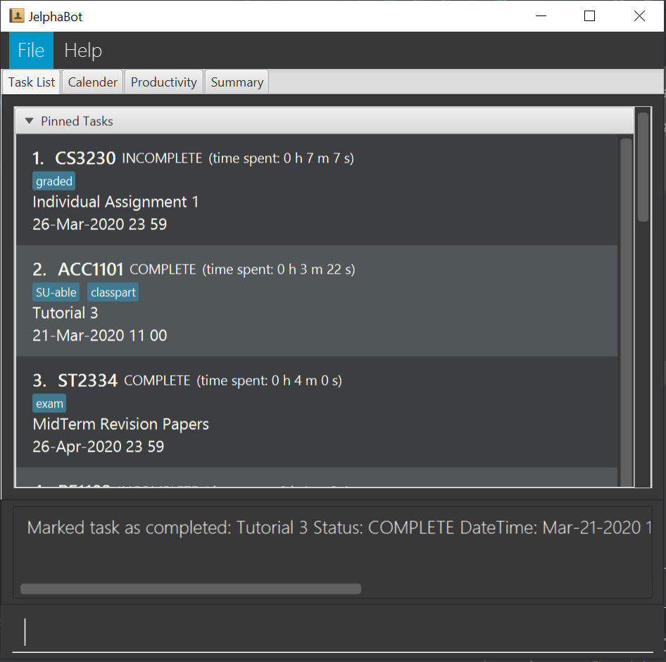
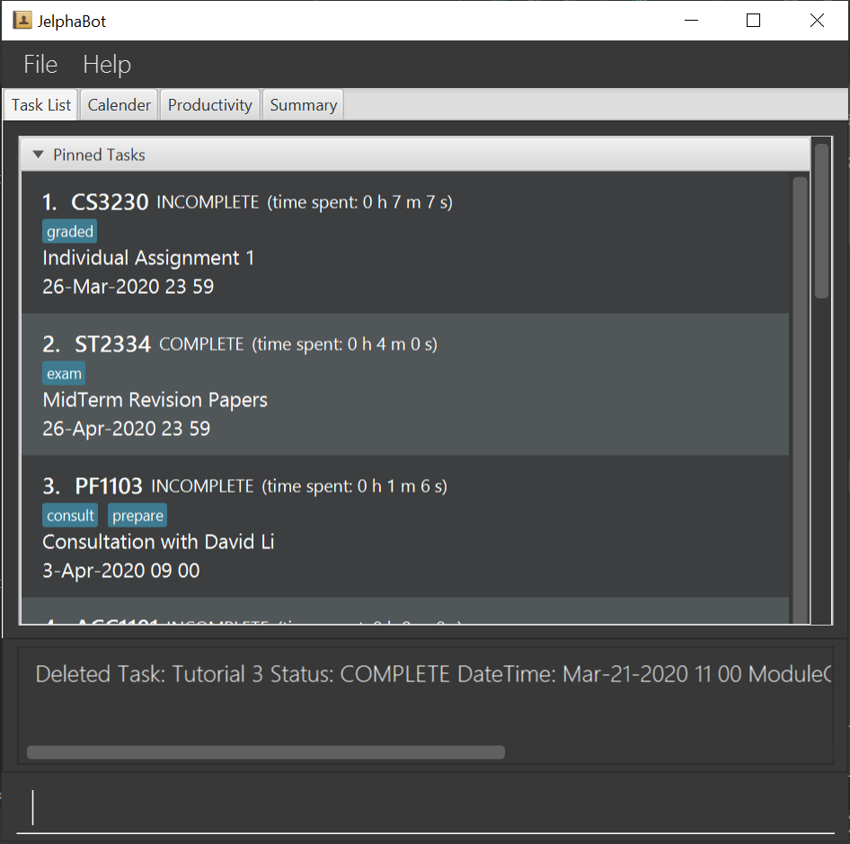

= JelphaBot - User Guide
:site-section: UserGuide
:toc:
:toc-title:
:toc-placement: preamble
:sectnums:
:imagesDir: images
:stylesDir: stylesheets
:xrefstyle: full
:experimental:
ifdef::env-github[]
:tip-caption: :bulb:
:note-caption: :information_source:
endif::[]
:repoURL: https://github.com/AY1920S2-CS2103T-F09-2/main

By: `Team 2103T-F09-02`      Since: `Jan 2020`      Licence: `MIT`

== Preface
=== Introduction
Welcome to JelphaBot! +
If you are just starting out, this quick start section will help you get JelphaBot started right
away! It will equip you with the basics so that you can quickly enjoy and master the features offered.

JelphaBot is *a desktop app for managing tasks* specially designed by and for NUS students that allows you to
*recognise important tasks at a glance* so that you can prioritise commitments and manage your time.

You can enter commands in JelphaBot through a *Command Line Interface* (CLI), which means that if you can *type quickly*,
JelphaBot can help you get work done faster than a traditional mouse-controlled Graphical User Interface (GUI),
*while still retaining the benefits of a beautiful user interface*.

Interested? Jump to the <<Quick Start>> to get started.
Enjoy!

== Quick Start

=== Using the User Guide
This User Guide is filled with information to help you set up and make the best out of you very own customizable JelphaBot!
You will be able to learn more about the commands are available for you, together with examples of how they are used.
These commands are also consolidated under <<Command Summary>> for your convenience.

To aid in your understanding throughout this User Guide, you may find it useful to refer to the following table below for the different symbols and
formatting used throughout this guide.

[width="100%",cols="40%,<60%,options="header",]
|=======================================================================
|*Symbol* | *What does it mean?*
a| `code` | Command that can be typed into the command box
ifdef::env-github[]
| :white_check_mark: | Expected result after executing the command
| :bulb: | Tips and tricks that might be useful
| :information_source: | Additional information that is good to know
| :heavy_exclamation_mark: | Important pointers to take note
endif::[]
ifndef::env-github[]
a| icon:check[role="green", size="2x"] | Expected result after executing the command
a| icon:lightbulb-o[role="icon-tip", size="2x"] | Tips and tricks that might be useful
a| icon:info-circle[role="icon-note", size="2x"] | Additional information that is good to know
a| icon:exclamation-circle[role="icon-important", size="2x"] | Important pointers to take note
endif::[]
|=======================================================================

. Ensure you have Java `11` or above installed in your Computer.
. Download the latest `jelphabot.jar` link:{repoURL}/releases[here].
. Copy the file to the folder you want to use as the home folder for your JelphaBot.
. Double-click the file to start the app.
The GUI should appear in a few seconds.
+
image::Ui.png[width="790"]
_Figure 1: Expected result after running `JelphaBot`_
+
. Type the command in the command box and press kbd:[Enter] to execute it. +
e.g. typing *`help`* and pressing kbd:[Enter] will open the help window.
. Some example commands you can try:

* *`list`* : lists all tasks
* **`add`**`d/Assignment 1 dt/10-Mar-2020 23 59 m/CS2103T` : adds a task with description `Assignment 1` to the task list.
* **`delete`**`3` : deletes the 3rd task shown in the current list
* *`exit`* : exits the app

. Refer to <<Features>> for details of each command.

[[Features]]

== Features
====
*Command Format*

**Task list commands**

These command formats are applicable for the following commands: +
Add Command, Edit Command, Find Command.

* Words in `UPPER_CASE` are the parameters to be supplied by the user e.g. in `add d/DESCRIPTION`, `DESCRIPTION` is a parameter which can be used as `add d/Assignment 1`.
* Items in square brackets are optional e.g `d/DESCRIPTION [p/PRIORITY]` can be used as `d/Assignment 1 p/0` or as `d/Assignment 1`.
* Items with `…`​ after them can be used multiple times including zero times e.g. `[t/TAG]...` can be used as `{nbsp}` (i.e. 0 times), `t/project`, `t/project t/graded` etc.
* Parameters can be in any order e.g. if the command specifies `d/DESCRIPTION p/PRIORITY`, `p/PRIORITY d/DESCRIPTION` is also acceptable.
====

=== General
Upon running JelphaBot, you will see various components on it's main display screen. The components of the main screen is labelled below.

image::MainUi.png[width="790"]

The function of each component is as follows:
1. *Tabs Panel*: This is where you can navigate between the different features located in various tabs.
2. *Main Panel*: This is the main display screen which corresponds to the tab it is under.
3. *Results Display*: This is where the results of your commands are displayed as JelphaBot interacts with you!
4. *Command Box*: This is where you key in your own respective commands.

As seen above, JelphaBot has four tabs, Task List, Calendar, Productivity and Notes.
You can switch between tabs anytime by pressing `Ctrl + tab` on your keyboard to move to the tab on the right.
If you are already on the rightmost tab, it wraps around to the leftmost tab.

==== Saving the data

JelphaBot automatically saves your data whenever you make a change. There is no need to save manually.

==== Viewing help : `help`

If you can't recall the command you need, the `help` command opens a help popup window which links to this user guide. +
Format: `help`

[.text-center]
image::ug_figures/help.png[width="600]
[.text-center]
_Figure 2: Example of an expected result after running `help`_

==== Exiting the program : `exit`

You can exit the program anytime by entering the `exit` command directly from any page. +
Format: `exit`
// no image needed

****
* Exiting the application before stopping any running timer wil cause all recorded time since the timer was started to be lost.
****

=== Managing Tasks

JelphaBot allows you to track and manage your tasks. You can view and sort all your tasks from the Task List page.

==== Reading the task list

The task list is formatted so that you can distinguish urgent tasks at first glance. The start of every task is labelled
with a module code so that you can visually categorize them. Tasks are tagged according to their importance:

* Default priority
* *High Priority* tasks will be *bolded* to denote important tasks.
* _Low priority_ tasks will be _italicized_ to denote optional tasks.

The start of every task will be labelled with a module code so that you can visually categorize them.
Go <<#add, here>> to read more about adding tasks with priority and <<#edit, here>> for editing task priority.

You can also tag tasks with additional information. To read more about tags, go <<#Tags, here>>

// tag::add[]
==== Adding a task: `add`

Add a task to your task list. +
Format: `d/DESCRIPTION dt/DATETIME m/MODULE_CODE [p/PRIORITY] [t/TAG]...`

[.text-center]
image::ug_figures/add.png[width="600"]
[.text-center]
_Figure 3: Example of an expected result after running `add`_

****
* For dt/DATETIME inputs, we recommend the format MMM-dd-YYYY HH mm, but it also allows some other formats.
// TODO list datetime accepted formats here
* Values that p/PRIORITY can take are -1, 0 or 1. If not specified, DEFAULTS TO 1.
****

[TIP]
A task can have any number of tags (including 0)

Examples:

* `add add d/Assignment 1 dt/Jan-01-2020 23 59 m/CS3230 p/1`
* `add add d/Project TP dt/Jan-01-2020 23 59 m/CS2103T p/1 t/pair work`
// end::add[]

// tag::list[]
==== Listing all tasks : `list`

List all tasks in your task list. Optional arguments can be added to dictate sorting order for your tasks. +
Format: `list [SORTING_ORDER]`

****
* If no `SORTING_ORDER` is provided, tasks will be grouped by date by default.
* Valid `SORTING_ORDER` values are `date` (groups tasks by date) and `module` (Groups tasks by module code)
****
[.text-center]
image::ug_figures/list.png[width="600"]
[.text-center]
_Figure 4: Example of an expected result after running `list`_

===== Group tasks by Date : `list date`
Group your tasks into the following categories:

* Pinned +
(Pinned tasks will always be displayed at the top. To read more about pinning tasks, go <<#pin, here>>)
* Overdue  +
(Shows tasks which are uncompleted and past their due date)
* Due Today +
(Shows tasks due by the end of the day)
* Due This week +
(Shows tasks due by the end of the week, defined as before the next upcoming Monday)
* Due Sometime +
(Shows all other tasks that do not fit into prior categories)

===== Group tasks by Date : `list module`
Groups tasks based on their defined module code. Modules will be presented in alphabetical order.

// end::list[]

==== Locating tasks by name: `find`

Finds tasks in your task list whose description contain any of the given keywords. +
Format: `find KEYWORD [MORE_KEYWORDS]`
[.text-center]
image::ug_figures/find.png[width="600"]
[.text-center]
_Figure 5: Example of an expected result after running `find`_

****
* The search is case insensitive. e.g `hans` will match `Hans`
* The order of the keywords does not matter. e.g. `Hans Bo` will match `Bo Hans`
* Only the description is searched.
* Only full words will be matched e.g. `Han` will not match `Hans`
* Tasks matching at least one keyword will be returned (i.e. `OR` search). e.g. `Hans Bo` will return `Hans Gruber`, `Bo Yang`
****

Examples:

* `find assignment` +
Returns `Assignment 1` and `assignment task`
* `find Tutorial Project MidTerm` +
Returns any task having descriptions of `Tutorial`, `Project`, or `MidTerm`

// tag::edit[]
==== Editing a task : `edit`

Edit an existing task in your task list.
. +
Format: `edit INDEX [d/DESCRIPTION] [dt/DATETIME] [m/MODULE_CODE] [p/PRIORITY (-1, 0, or 1)]
[t/TAG]...`

image::edit.png[width="600"]
_Figure 6: Example of an expected result after running `edit`_

****
* Edits the task at the specified `INDEX`.
* The index refers to the index number shown in the displayed task list.
* The index *must be a positive integer* 1, 2, 3, ...
* At least one of the optional fields must be provided.
* Existing values will be updated to the input values.
* When editing tags, the existing tags of the task will be removed i.e adding of tags is not cumulative.
* You can remove all the task's tags by typing `t/` without specifying any tags after it.
* The task to edit cannot have a running timer.
****

Examples:

* `edit 1 m/CS2105 d/Tutorial 2` +
Edits the moduleCode of the 1st task to be `cs2105` and description to `Tutorial 2` respectively.
* `edit 2 dt/Jan-2-2020 23 59 t/` +
Edits the date and time of the 2nd task to be `Jan-2-2020 23 59` and clears all existing tags.
// end::edit[]

==== Completing a task : `done`

Marks a task in your task list as done. +
Format: `done INDEX`

_Figure 7: Example of an expected result after running `done`_

****
* Marks the task at the specified `INDEX` as done.
* The index refers to the index number shown in the displayed task list.
* The index *must be a positive integer* 1, 2, 3, ...
****

// tag::delete[]
==== Deleting a task : `delete`

Delete a task from your task list. +
Format: `delete INDEX`

_Figure 8: Example of an expected result after running `delete`_

****
* Deletes the task at the specified `INDEX`.
* The index refers to the index number shown in the displayed task list.
* The index *must be a positive integer* 1, 2, 3, ...
****

Examples:

* `list` +
`delete 2` +
Deletes the 2nd task in the task list.
* `find Betsy` +
`delete 1` +
Deletes the 1st task in the results of the `find` command.

// end::delete[]

==== Clearing all task entries : `clear`

Clears all entries from your task list. +
Format: `clear`

image::clear.png[width="600"]
_Figure 9: Example of an expected result after running `clear`_

// tag::pin[]
==== Pin Important tasks  : `pin`

You can pin important tasks to the top of the task list with the `pin` command. +
Pinned tasks will always be displayed in the Pinned Tasks group in the task list. +
Trying to `pin` a task that is already pinned will unpin it.

// end::pin[]

// tag::showcompleted[]
==== Show all completed tasks : `show-completed`
You can display all the tasks in your task list that have been completed.

// end::showcompleted[]

// tag::showincomplete[]
==== Show all incomplete tasks: `show-incomplete`
You can display all the tasks in your task list that are currently incomplete.

// end::showincomplete[]

==== Sort tasks : `sort`  [coming in v2.0]

You can change how tasks are sorted with the `sort` command.
Format: `sort SORTING_ORDER`

Valid `SORTING_ORDER` values include `date`, `module`, and `priority`.

==== Clearing all task entries : `clear`

// tag::pin[]
==== Pin Important tasks  : `pin`

You can pin important tasks to the top of the tasklist with the `pin` command. +
Pinned tasks will always be displayed in the Pinned Tasks grouping in the task list. +
Trying to `pin` a task that is already pinned will unpin it instead.

// end::pin[]

==== Clearing all task entries : `clear`

Clears all entries from the task list by calling `clear` directly from a task page or from the landing page. +
Format: `clear`

image::clear.png[width="600"]
_Figure 9: Example of an expected result after running `clear`_

== Set Reminders and Notifications  `[coming in v2.0]`

=== Adding reminder : `reminder`
Adds a reminder to your specified task and reminds you of the task if the current time is within the time-frame specified
by you. +
Format: `reminder INDEX rd/DAYS rh/HOURS`

* Adds a reminder to the task which is at the specified `INDEX`.
* The index refers to the index number shown in the displayed task list.
* The index *must be a positive integer* 1, 2, 3, ....
* `DAYS` refers to the number of days before the due date of the task when you want to be reminded of it.
* `HOURS` refers to the number of hours before the due date of the task when you want to be reminded of it.

****
* You can only specify `DAYS` to be in the range 0 - 7 inclusive.
* You can only specify `HOURS` to be in the range 0 - 24 inclusive.
* Tasks that are completed cannot have a reminder.
* Tasks can only have one reminder.
****

==== Removing reminder `[coming in v2.0]`
==== Reminder popup notification `[coming in v2.0]`

=== Productivity Tracking

// tag::productivitytracker[]
==== Track productivity : `productivity`
Apart from the function to switch tabs by pressing `Ctrl + tab` on your keyboard, you can enter the `productivity` command
to manually switch to the producivity tab.
The productivity panel will then show you your productivity for the day. +
Format: `productivity`

image::productivityTab.png[width="790"]
_Figure #: Expected result after running `productivity`_

// end::productivitytracker[]

==== Starting timer for a task : `start`

Starts timer running for a task. +
Format: `start INDEX`

image::start.png[width="790"]
_Figure #: Expected result after running `start`_

****
* Starts the timer for the task at the specified `INDEX` if timer was not running.
* The index refers to the index number shown in the displayed task list.
* The index *must be a positive integer* 1, 2, 3, ...
* The task to be timed cannot be a completed task.
****

==== Stopping timer for a task : `stop`

Stops running timer for a task. +
Format: `stop INDEX`

image::stop.png[width="790"]
_Figure #: Expected result after running `stop`_

****
* Stops the timer for the task at the specified `INDEX` if timer was running.
* The index refers to the index number shown in the displayed task list.
* The index *must be a positive integer* 1, 2, 3, ...
* The task has to have a running timer.
****

==== Receiving encouragement and criticism

JelphaBot automatically tracks the user's productivity in a day and outputs the appropriate response to the user's
achievements and task completion rate. +
There is no need to manually ask for compliments or criticism.

=== Calendar
==== View calender : `calendar`
Apart from the function to switch tabs by pressing `Ctrl + tab` on your keyboard, you can enter the `calendar` command
to manually switch to the calendar tab.
The calendar panel will then show you your schedule for the current month with today's date highlighted. +

Format: `calendar`

image::CalendarUi.png[width="790"]

==== Change month and year view of Calendar : `calendar`
Displays the tasks due on specified date, while highlighting that day on the calendar.
The task list panel on the left will display the tasks due today. +
Format: `calendar MONTHYEAR`

****
* For MONTHYEAR format, it should be MMM-YYYY, but it also allows some other formats shown when you type in the command word.
****

Examples:

* `calendar Apr-2020`

image::CalendarView.png[width="790"]

Displays month of April in the year 2020 in the calendar panel on the right.

==== Show tasks due on specific date : `calendar`
Displays the tasks due on specified date, while highlighting that day on the calendar +
Format: `calendar DATE`

****
* The date specified *must be for the month and year of the shown Ui* for that corresponding date to be highlighted
* For DATE formats, we recommend the format to be MMM-dd-YYYY, but it also allows some other formats shown when you type in the command word.
****

Examples:

* `calendar Mar-1-2020`
* `calendar Mar/1/2020` +

image::CalendarDate.png[width="790"]

Highlights 1st of March in the calendar panel on the right and displays the corresponding tasks due on the left.

==== Navigate directly to today's date on Calendar : `calendar`
Immediately displays the calendar view for this month and highlights today's date.
The task list panel on the left will display the tasks due today as well. +
Format: `calendar today`

Examples:

* `calendar today` +

image::CalendarToday.png[width="790"]

Displays month of March in the year 2020 in the calendar panel on the right, with today's date highlighted and displays the corresponding tasks due today on the left.

=== Morning call/Night debrief
Displays the tasks to be completed within the day (Morning Call), and the tasks that have been completed so far (Night Debrief)

Morning Call and Night Debrief are separate windows that will open on app startup and exit respectively.

=== Colour-code modules and font style for prioritised tasks `[coming in v2.0]`

== FAQ

*Q*: How do I transfer my data to another Computer? +
*A*: Install the app in the other computer and overwrite the empty data file it creates with the file that contains the data of your previous Address Book folder.

== Command Summary

* *Help* : `help`
* *Add* `[d/DESCRIPTION] [dt/DATETIME] [m/MODULE_CODE] [p/PRIORITY] [t/TAG]…` +
e.g. `add add d/Project TP dt/Jan-01-2020 23 59 m/CS2103T p/1 t/pair work`
* *List* : `list`
* *Find* : `find KEYWORD [MORE_KEYWORDS]` +
e.g. `find Tutorial Assignment`
* *Edit* : `edit INDEX
[d/DESCRIPTION]
[dt/DATETIME]
[m/MODULE_CODE]
[p/PRIORITY]
[t/TAG]...` +
e.g. `edit 1 m/CS2105 d/Tutorial 2`
* *Done* : `done INDEX` +
e.g. `done 1`
* *Delete* : `delete INDEX` +
e.g. `delete 3`
* *Clear* : `clear`
* *Exit* : `exit`
* *Show Completed Tasks*: `show-completed`
* *Show Incomplete Tasks*: `show-incomplete`
* *Reminder* : `reminder INDEX rd/DAYS rh/HOURS` +
e.g. `reminder 2 rd/1 rh/1`
* *Productivity* : `productivity`
* *Timer* : `start INDEX` or `stop INDEX` +
e.g. `start 1` or `stop 1`
* *Calendar* : `calendar`
* *Calendar Date* : `calendar DATE` +
e.g. `calendar Jan-1-2020`
* *Change Calendar View* : `calendar MONTHYEAR` +
e.g. `changeCalendar Apr-2020`
* *Today's Calendar View* : `calendar today`
